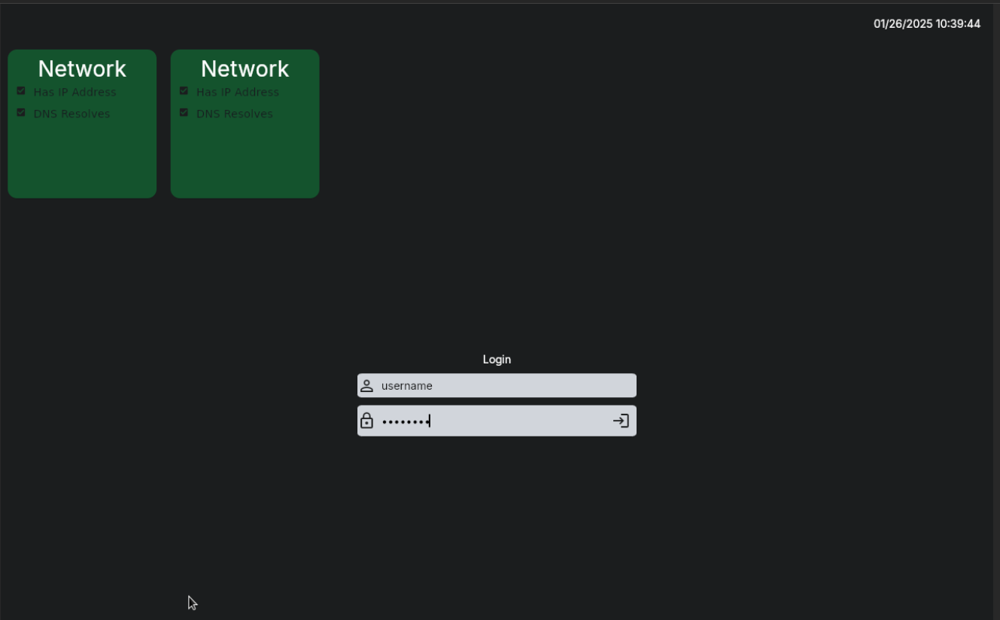

# LightDM Server Greeter - Very WIP

A LightDM Greeter written in Flutter for at a glance views of server health.



## Features

- [x] Can actually login
- [ ] Fetch server health over standard API on unix socket
- [ ] Example server health server

## Usage / Development

In `/etc/lightdm/lightdm.conf` set
```
[Seat:*]
greeter-session=lightdm-server-greeter
```

Then create `/usr/sbin/lightdb-server-greeter` executable with
```
#!/bin/bash
cd /opt/servergreeter
echo "Starting up Server Greeter" > /msg
exec ./servergreeter > /msg 2>&1
```

Then create `/usr/share/xgreeters/lightdm-server-greeter.desktop` with 
```
[Desktop Entry]
Name=LightDM Server Greeter
Comment=A LightDM Greeter written in Flutter for at a glance views of server health.
Exec=lightdm-server-greeter
Type=Application
```

Then assuming you have a working flutter installation, all the C build tools, dev libs for lightdm and glib and gtk, you can run
```
./test.sh
```
To stage the greeter at `/opt/servergreeter`

Then you can run lightdm directly to test
```
lightdm -d
```

## Components

### C interop library
Under `lightdm_interop` is a C library that serves as the bindings between Dart ffi and LightDM. 

Attempting to import any stdlib/glib/lightdm headers in the H files will cause Dart to not be able to autogen the ffi bindings.

### Flutter 

The UI is written in Flutter, utilizing a 